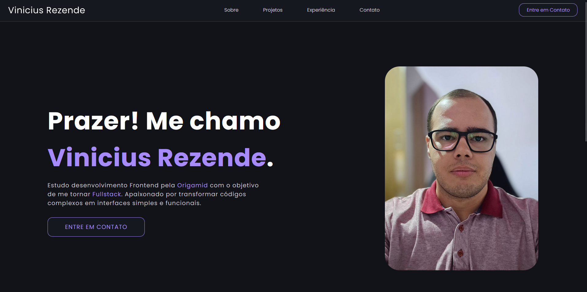

# Portfólio — Vinicius Rezende

- Meu portfólio pessoal desenvolvido com HTML e CSS, apresentando meus projetos, habilidades e formas de contato.

##  Tecnologias

- HTML5
- CSS3
- Git & GitHub

## 🛠️ Próximas melhorias

- [x] Hospedagem no GitHub Pages
- [ ] Menu hambúrguer para mobile
- [ ] Animações de entrada nas seções
- [ ] Modo claro/escuro
- [ ] Formulário de contato funcional

##  Seções

- **Sobre** — Apresentação pessoal
- **Projetos** — Projetos desenvolvidos com links
- **Experiência** — Tecnologias e ferramentas
- **Contato** — Links para GitHub, LinkedIn e WhatsApp

##  Deploy

https://vinirez.github.io/Portifolio/

##  Preview

##  Autor

Desenvolvido por mim durante meus estudos de desenvolvimento Web.